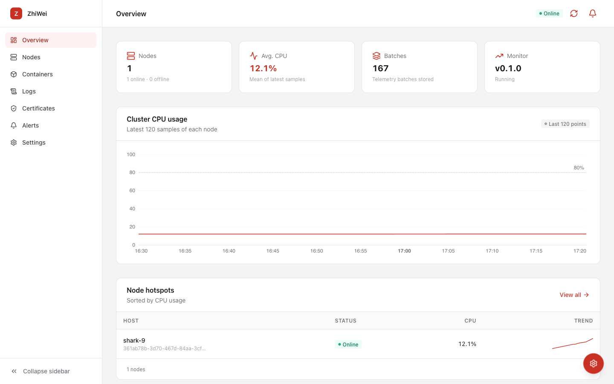
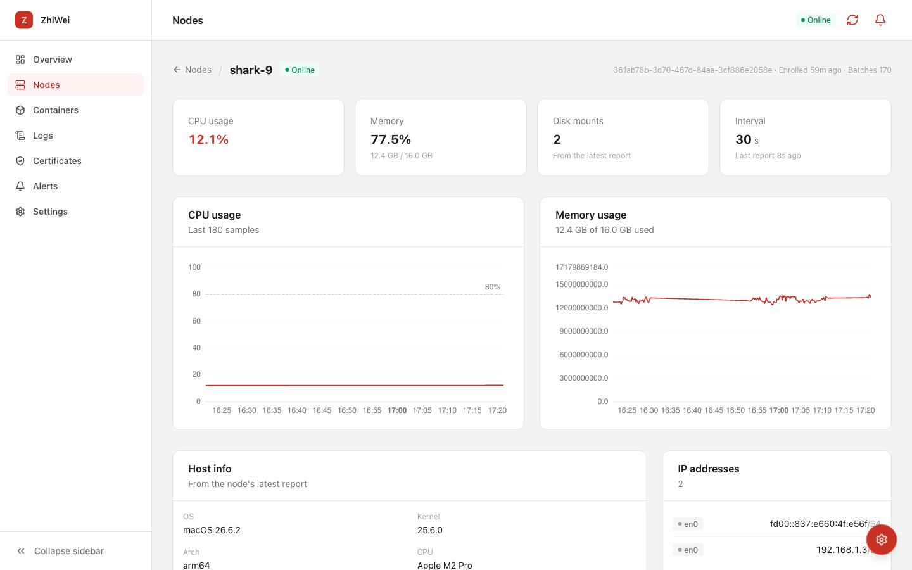
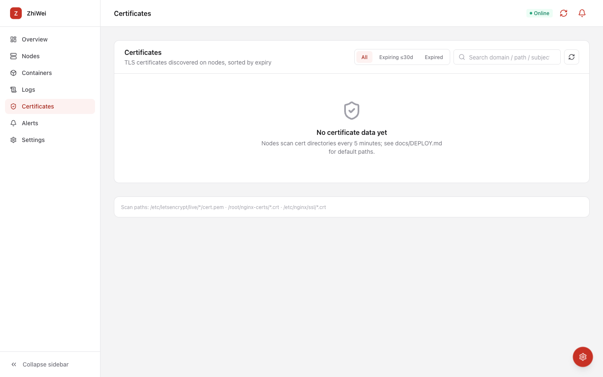
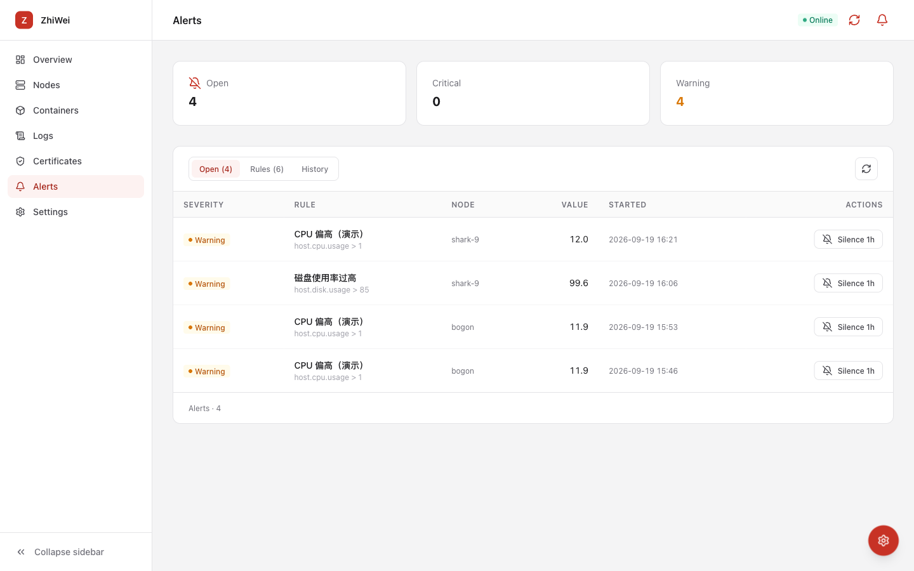
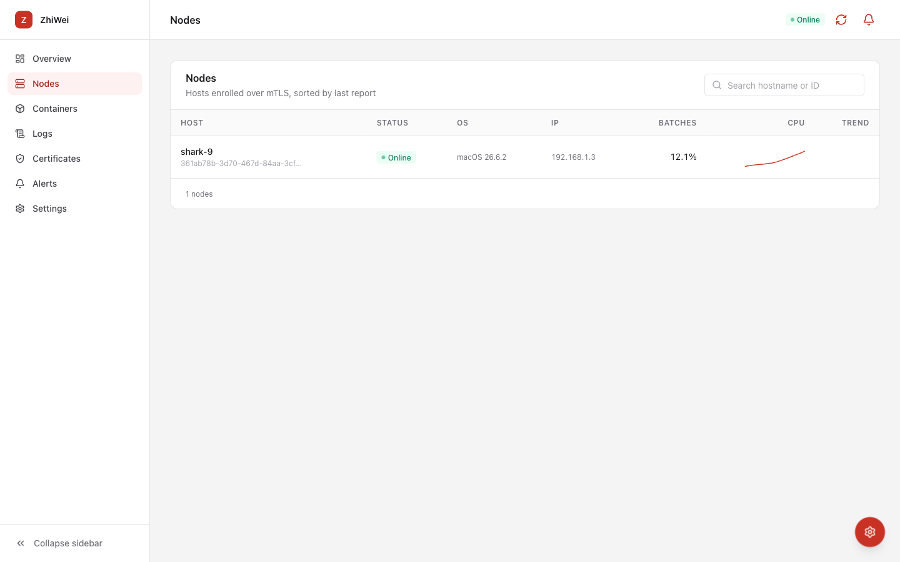
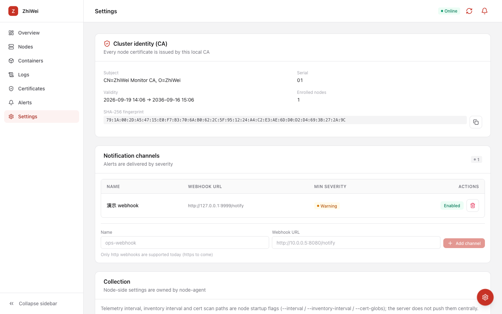
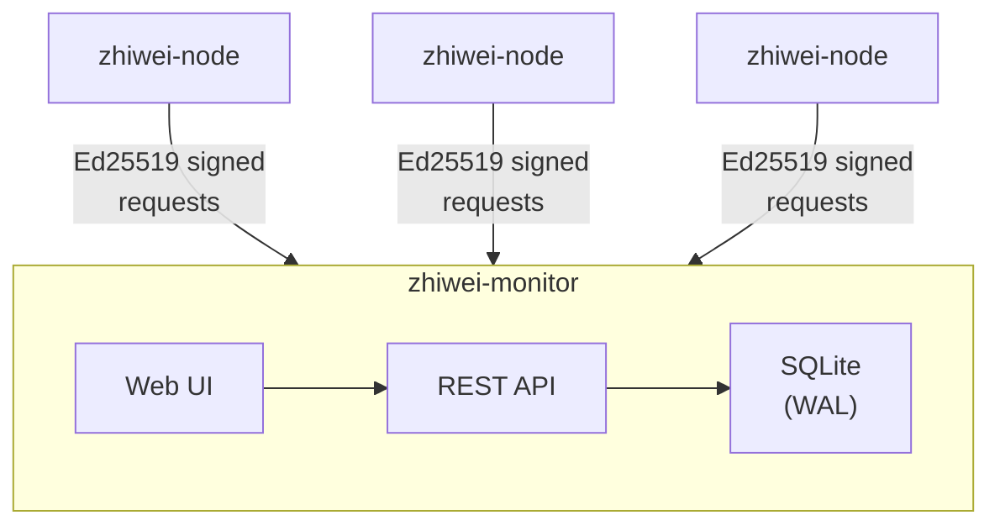

# ZhiWei

> Know the subtle, await the right moment.

A self-hosted, single-binary infrastructure monitoring platform for indie developers
and one-person companies — resource monitoring, service health, certificate management,
remote operations, alerting, and MCP integration.
No Prometheus, Grafana, K8s, or Postgres required.

**One human plus one agent, managing N machines.**

## Features

- **Multi-host telemetry**: CPU, memory, disk, network, processes, containers
- **Service health probes**: HTTP, TCP, TLS — executed on nodes, converged in console
- **Certificate tracking**: Scan and expiry monitoring for discovered certificates
- **Alert system**: Threshold rules with webhook notifications
- **Remote operations**: Container logs, process signals, host reboot — all signed and audited
- **MCP server**: Read-only tools for AI agents (Claude Desktop, etc.)
- **Single binary**: Rust + SQLite, ~105 MB image, 5-minute setup

## Quick Start

### Local Dev

```sh
./scripts/dev.sh start     # Start monitor + ops + auto-enroll a local node
./scripts/dev.sh status    # Check process and log status
./scripts/dev.sh stop
```

Console at <http://127.0.0.1:8443/> — admin token at `data/admin.token`.

### Build from Source

Prerequisites: Rust 1.75+ (macOS / Linux)

```sh
# Terminal 1: start monitor
cargo run --bin zhiwei-monitor

# Terminal 2: start node (from another terminal after monitor prints the bootstrap token)
ZHIWEI_MONITOR_URL=https://127.0.0.1:8443 \
ZHIWEI_BOOTSTRAP_TOKEN=<token> \
cargo run --bin zhiwei-node
```

First monitor startup:
1. Generates self-signed CA in `data/ca/`
2. Issues monitor server certificate
3. Creates SQLite database `data/monitor.db`
4. Prints a one-time bootstrap token (10-minute TTL)

### Install Pre-built Binary

```sh
curl -fsSL https://raw.githubusercontent.com/zhiwei/zhiwei/main/scripts/install.sh | sh
```

Supports Linux (x86_64/aarch64 × musl/gnu) and macOS (arm64/x86_64).
Use `-s -- --bin monitor` to install the server.

### Docker

```sh
docker build -t zhiwei-monitor .
docker run -d -p 8443:8443 -v zhiwei-data:/var/lib/zhiwei zhiwei-monitor
```

## Screenshots

| Overview | Node detail |
| --- | --- |
|  |  |

| Certificates | Alerts |
| --- | --- |
|  |  |

| Containers | Settings |
| --- | --- |
|  |  |

## Architecture



- **Nodes** report telemetry every 30s via Ed25519-signed requests
- **Monitor** stores in SQLite, serves Web UI and REST API
- **Console** uses Bearer admin token; **nodes** use Ed25519 request signing — two separate auth systems

## Security Model

- **Node identity via Ed25519 signing**, not TLS client certificates — works behind
  edge-terminated TLS on PaaS platforms
- **Bootstrap token** is one-time (10-minute TTL on self-hosted, long-lived env var on PaaS)
- **Command channel**: ops server signs commands, nodes sign responses —
  monitor can't forge commands, nodes can't forge responses
- **Replay protection**: timestamp window (±300s) + nonce uniqueness
- Signing keys: 0600 permissions required

## Deployment

See [docs/DEPLOY.md](./docs/DEPLOY.md) for full deployment guide covering:

- Self-hosted (binary, Docker, systemd)
- Managed platforms (Render, Railway, Northflank)
- Isolated / restricted networks (GitHub Releases not reachable)
- Enrollment via console

## Documentation

- [docs/FAQ.md](./docs/FAQ.md) — short answers to common questions
- [docs/architecture.md](./docs/architecture.md) — system overview
- [docs/api.md](./docs/api.md) — REST API and MCP server reference
- [docs/DEPLOY.md](./docs/DEPLOY.md) — deployment guide
- [docs/ALERTS.md](./docs/ALERTS.md) — alert rules and notification channels
- [docs/PROBES.md](./docs/PROBES.md) — service health probes
- [docs/SERVICE-HEALTH.md](./docs/SERVICE-HEALTH.md) — service health design (current + planned)
- [docs/BACKUP.md](./docs/BACKUP.md) — backup and restore
- [docs/TROUBLESHOOTING.md](./docs/TROUBLESHOOTING.md) — common issues
- [docs/roadmap.md](./docs/roadmap.md) — current status and upcoming work

## Configuration

| Variable | Description |
| --- | --- |
| `ZHIWEI_DATA_DIR` | Data directory (CA, SQLite, signing keys) |
| `ZHIWEI_ADMIN_TOKEN` | Console credential (min 16 chars) |
| `ZHIWEI_BOOTSTRAP_TOKEN` | Long-lived enrollment token (min 16 chars) |
| `ZHIWEI_PLAIN_HTTP` | `1` when behind edge-terminated TLS |
| `ZHIWEI_LISTEN` | Listen address (e.g. `0.0.0.0:8443`) |
| `ZHIWEI_OPS_DISABLE` | `1` to disable ops-server (data-plane only) |
| `RUST_LOG` | Log level, default `info,zhiwei=debug` |

## API

See [docs/api.md](./docs/api.md) for full API reference including:
read endpoints, write endpoints, AI tokens, MCP server tools, node-side endpoints.

## Contributing

See [CONTRIBUTING.md](./CONTRIBUTING.md).

## License

Apache-2.0
