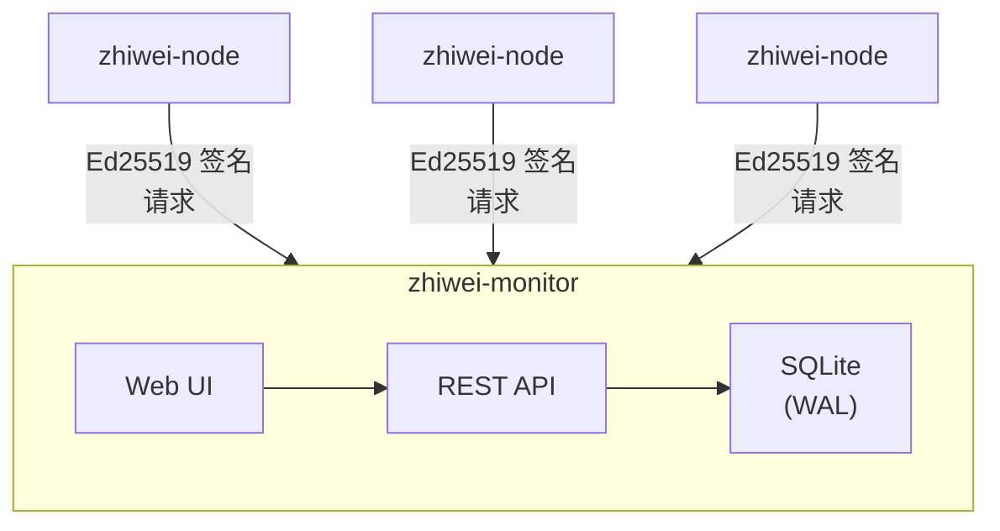

[English](./README.md) | [中文文档](./README.zh-CN.md)

# ZhiWei · 知微

> 见微知著，静待其时。

面向独立开发者与一人公司的自托管、单二进制基础设施监控平台——资源监控、
服务健康、证书管理、远程运维、告警与 MCP 集成。无需 Prometheus、Grafana、
K8s 或 Postgres。

**一个人加一个代理，管理 N 台机器。**

## 功能

- **多主机遥测**：CPU、内存、磁盘、网络、进程、容器
- **服务健康探测**：HTTP / TCP / TLS — 在节点侧执行，在控制台汇总
- **证书跟踪**：扫描已发现的证书并监控到期时间
- **告警系统**：阈值规则 + Webhook 通知
- **远程运维**：容器日志、进程信号、主机重启 — 全程签名 + 审计
- **MCP 服务**：面向 AI 代理（Claude Desktop 等）的只读工具
- **单二进制**：Rust + SQLite，镜像约 105 MB，5 分钟上手

## 快速开始

### 本地开发

```sh
./scripts/dev.sh start     # 启动 monitor + ops + 自动注册一个本地节点
./scripts/dev.sh status    # 查看进程与日志状态
./scripts/dev.sh stop
```

控制台访问 <http://127.0.0.1:8443/>，管理员令牌位于 `data/admin.token`。

### 从源码构建

前置依赖：Rust 1.75+（macOS / Linux）

```sh
# 终端 1：启动 monitor
cargo run --bin zhiwei-monitor

# 终端 2：等 monitor 打印 bootstrap token 后，在另一个终端启动节点
ZHIWEI_MONITOR_URL=https://127.0.0.1:8443 \
ZHIWEI_BOOTSTRAP_TOKEN=<token> \
cargo run --bin zhiwei-node
```

Monitor 首次启动时：

1. 在 `data/ca/` 生成自签名 CA
2. 签发 monitor 服务器证书
3. 创建 SQLite 数据库 `data/monitor.db`
4. 在日志中打印一次性 bootstrap token（10 分钟有效期）

### 安装预编译二进制

```sh
curl -fsSL https://raw.githubusercontent.com/hancic128/zhiwei/main/scripts/install.sh | sh
```

支持 Linux（x86_64/aarch64 × musl/gnu）与 macOS（arm64/x86_64）。
使用 `-s -- --bin monitor` 安装服务端。

### Docker

```sh
docker build -t zhiwei-monitor .
docker run -d -p 8443:8443 -v zhiwei-data:/var/lib/zhiwei zhiwei-monitor
```

## 截图

| 总览 | 节点详情 |
| --- | --- |
|  |  |

| 证书 | 告警 |
| --- | --- |
|  |  |

| 容器 | 设置 |
| --- | --- |
|  |  |

## 架构



- **节点** 每 30 秒通过 Ed25519 签名请求上报遥测数据
- **Monitor** 写入数据库，提供 Web UI 与 REST API
- **控制台** 使用 Bearer 管理员令牌；**节点** 使用 Ed25519 请求签名 — 两套独立的认证体系

## 安全模型

- **节点身份基于 Ed25519 签名**，而非 TLS 客户端证书 — 在 PaaS 边缘终止 TLS 的场景下依然可用
- **Bootstrap token** 一次性（自托管模式 10 分钟 TTL，PaaS 模式下用长效环境变量）
- **指令通道**：ops 服务签发指令，节点签发执行回执 —
  monitor 无法伪造指令，节点无法伪造回执
- **重放保护**：时间窗口（±300 秒）+ nonce 唯一性
- 签名密钥要求 0600 权限

## 部署

详见 [docs/DEPLOY.md](./docs/DEPLOY.md)，涵盖：

- 自托管（二进制、Docker、systemd）
- 托管平台（Render、Railway、Northflank）
- 国内 / 隔离网络部署
- 通过控制台注册节点

## 配置

| 变量 | 说明 |
| --- | --- |
| `ZHIWEI_DATA_DIR` | 数据目录（CA、SQLite、签名密钥） |
| `ZHIWEI_ADMIN_TOKEN` | 控制台凭据（不少于 16 字符） |
| `ZHIWEI_BOOTSTRAP_TOKEN` | 长效注册 token（不少于 16 字符） |
| `ZHIWEI_PLAIN_HTTP` | 在边缘终止 TLS 时设为 `1` |
| `ZHIWEI_LISTEN` | 监听地址（如 `0.0.0.0:8443`） |
| `ZHIWEI_OPS_DISABLE` | 设为 `1` 关闭 ops 服务（仅数据面） |
| `RUST_LOG` | 日志级别，默认 `info,zhiwei=debug` |

## API

详见 [docs/api.md](./docs/api.md)，包含：只读接口、写入接口、AI token、
MCP 服务工具、节点侧接口。

## 参与贡献

参见 [CONTRIBUTING.md](./CONTRIBUTING.md)。

## 许可证

Apache-2.0