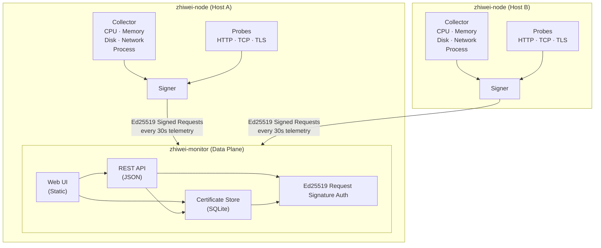
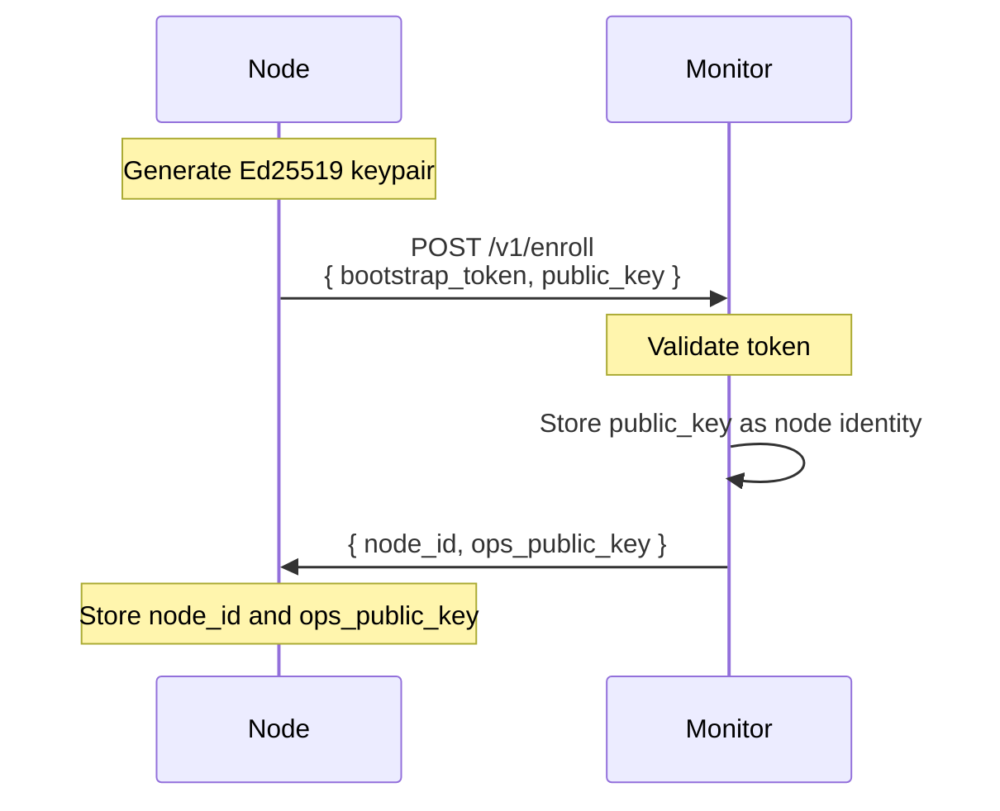
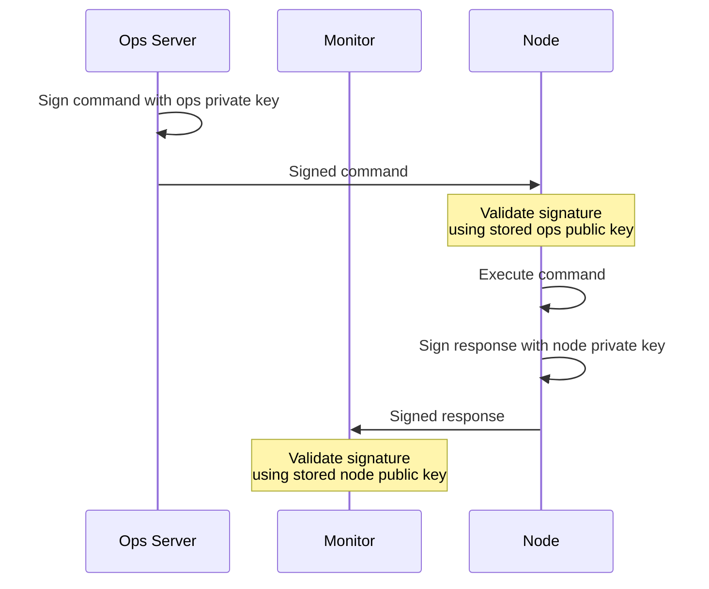
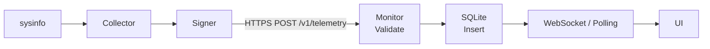
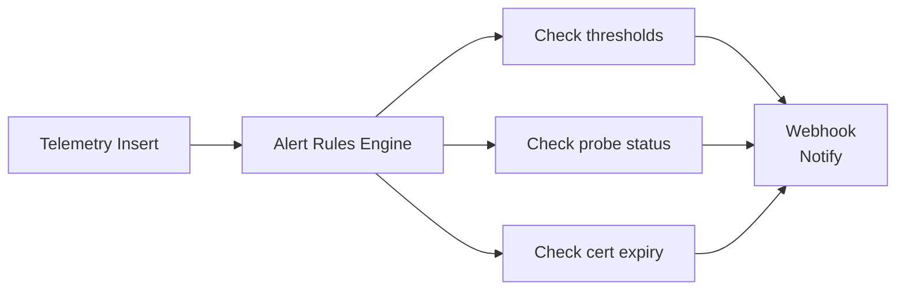

# Architecture

> High-level architecture of ZhiWei.

## Overview

ZhiWei follows a **hub-and-spoke** model:



## Components

### zhiwei-monitor (Server)

The central server component. Responsibilities:
- Node enrollment and identity management
- Telemetry ingestion and storage
- Alert evaluation and notification
- Certificate tracking
- Web UI hosting
- REST API

Technology:
- **Language**: Rust
- **Web Framework**: Axum
- **Database**: SQLite with WAL mode
- **Storage**: Local filesystem for certificates and logs

### zhiwei-node (Agent)

Runs on each monitored host. Responsibilities:
- System information collection
- Service health probing
- Certificate discovery
- Container monitoring
- Request signing

Technology:
- **Language**: Rust
- **System Info**: sysinfo crate
- **Networking**: rustls for HTTPS

### zhiwei-ops (Operations Server)

Handles remote command execution. Responsibilities:
- Command signing and dispatch
- Response collection
- Audit logging

## Authentication

### Node Identity (Ed25519 Request Signing)

Nodes authenticate using Ed25519 digital signatures, not TLS client certificates.



**Request Signing** — every request includes:
- `X-ZhiWei-Timestamp`: Unix timestamp (within ±300s window)
- `X-ZhiWei-Nonce`: Random unique value (anti-replay)
- `X-ZhiWei-Signature`: Ed25519 signature of `{method, path, timestamp, nonce, body}`

Monitor validates: (1) timestamp within ±300s, (2) nonce not seen before, (3) signature valid for registered node_id.

### Why Not mTLS?

```mermaid
graph LR
    A["node"] -->|"HTTPS"| B["PaaS Edge<br/>TLS terminated"]
    B -->|"plain HTTP"| C["container<br/>monitor"]

    Note over A,B: Traditional mTLS requires edge<br/>to forward client certificates
    Note over B,C: Edge terminates TLS — certificates lost
    Note over C: mTLS breaks here
```

Traditional mTLS requires the TLS terminator to forward client certificates.
This breaks on platforms that terminate TLS at the edge (Render, Railway, etc.).

Ed25519 signing works regardless of TLS termination point because:
- Authentication happens at the application layer
- TLS only provides encryption, not identity
- Ed25519 signatures prove node identity cryptographically

### Command Channel (Bidirectional Signing)



This creates a **closed loop**:
- Monitor can't forge commands (no ops private key)
- Node can't forge responses (no monitor private key)

## Data Flow

### Telemetry Collection



### Alert Evaluation



## Security Model

| Threat | Mitigation |
| --- | --- |
| Node impersonation | Ed25519 signature required |
| Replay attacks | Nonce + timestamp window |
| Command forgery | Ops key signing (monitor can't forge) |
| Response forgery | Node key signing (node can't fake) |
| TLS downgrade | Application-layer authentication |
| Secret disclosure | No secrets in logs; bootstrap tokens expire |

## Scalability

ZhiWei is designed for single-operator scenarios, not enterprise scale.

**Storage**:
- SQLite with WAL for concurrent reads
- Retention policy: 7 days for telemetry, 30 days for alerts

**Performance**:
- ~1.6 MB/day per node for telemetry (vs 57 MB with traditional approach)
- 30-second collection interval (configurable)

**Limits**:
- Tested with ~20 nodes
- Designed for personal use, not enterprise
